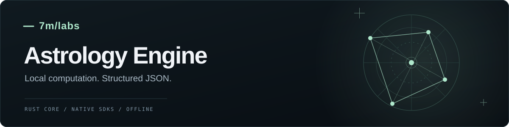

# 7mlabs Astrology

Engine chiêm tinh chạy offline, dùng chung lõi Rust qua các SDK native. Nhận dữ liệu sinh để tính lá số, quan hệ và dự báo ngay trong ứng dụng của bạn.

[](https://www.npmjs.com/package/@7mlabs/astrology)
[](https://github.com/7mlabs/sdk-astro/actions/workflows/neutral-engine.yml)
[](LICENSE)

**[Tài liệu](https://sevenmlabs-packages.velikho.chatgpt.site/docs/astrology-node/) · [Khám phá engine](https://sevenmlabs-packages.velikho.chatgpt.site/astro/) · [npm](https://www.npmjs.com/package/@7mlabs/astrology) · [English](README.md)**

- **Tính cục bộ:** package npm có sẵn binary native; không cần server tính toán, compiler hoặc tải dữ liệu khi chạy.
- **Kết quả có cấu trúc:** hành tinh, nhà, góc chiếu, facts và tham chiếu bằng chứng trong JSON envelope có version.
- **Một lõi tính toán:** Node.js, Python, .NET, Rust và C dùng chung triển khai Rust/Swiss Ephemeris.
- **Chuẩn bị context:** bộ nén riêng cho LLM, có chế độ khôi phục được đầy đủ và metadata về dữ liệu được giữ lại.

## Bắt đầu nhanh

Cài bản npm ổn định:

```sh
npm install @7mlabs/astrology
```

Lưu ví dụ vào `chart.cjs`, sau đó chạy `node chart.cjs`:

```js
const { calculate } = require('@7mlabs/astrology');

const birth = {
  utc: { year: 2000, month: 1, day: 1, hour: 12, minute: 0 },
  location: { latitude: 10.8231, longitude: 106.6297 },
  houseSystem: 'placidus'
};

const chart = calculate({ operation: 'natal', ...birth });

console.log({
  sun: chart.data.placements.find(body => body.id === 'sun').sign,
  planets: chart.data.placements.length,
  houses: chart.data.houses.length
});
// { sun: 'Capricorn', planets: 10, houses: 12 }
```

Giờ đầu vào là **UTC**; ứng dụng cần đổi giờ địa phương trước khi gọi SDK. Tọa độ tính bằng độ, bắc/đông dương. Response gồm metadata tính toán, warnings và errors bên cạnh `data`. [Request và response đầy đủ →](docs/natal.md)

Package có TypeScript declarations. `calculate()` chạy đồng bộ và throw lỗi có `.code`/`.result` khi tính toán thất bại; `calculateJson()` trả chuỗi JSON chứa envelope. Dùng worker cho các lượt quét tháng/năm dài trong ứng dụng tương tác.

## Tính năng

| Nhóm | API | Dữ liệu trả về |
| --- | --- | --- |
| Lá số cơ bản | `natal` | Sun–Pluto, bốn góc, 12 nhà và major aspects |
| Báo cáo cá nhân | `natalDomains` | Mười lĩnh vực, advanced facts, custom profiles và bằng chứng hỗ trợ |
| So sánh quan hệ | `couple` | Hai natal, synastry contacts, house overlays và sáu lĩnh vực |
| Lá số thứ ba | `composite` | Chart C dựng bằng trung điểm, có mười lĩnh vực |
| Sự kiện thiên văn | `events` | Quét ngày/tháng/năm: ingress, stations, pha Mặt Trăng, aspects và nhật/nguyệt thực toàn cầu |
| Dự báo cá nhân | `forecast` | Natal transits, ảnh hưởng sự kiện, tổng quan lịch và context theo lĩnh vực |
| Hình học | `chart`, `harmonic`, `synastry` | Tính từ các vị trí do caller cung cấp |
| Truy vấn theo nhu cầu | `geometry`, `aspects`, `houses`, `points` | Tám helpers gọi operation `query` |
| Nén payload | `compressPayload`, `calculateWithContext` | Context compact/focused/budgeted, giải mã bằng `expandContext` |

Engine trả dữ liệu tính toán và context để dựng báo cáo. Ứng dụng sử dụng SDK phụ trách lời luận giải và điểm tương hợp. Báo cáo lĩnh vực cá nhân dùng một người; `couple` so sánh hai người. Composite là chart tượng trưng dựng bằng trung điểm.

### Chọn lĩnh vực cá nhân

Dùng `birth` từ ví dụ bắt đầu nhanh:

```js
const report = calculate({
  operation: 'natalDomains',
  ...birth,
  domains: ['career', 'love']
});

console.log(report.data.domains.career.report.sections);
```

Mười lĩnh vực có sẵn: công việc, tình cảm, quan hệ, gia đình, tài chính, bản thân, học tập, sáng tạo, nội tâm và đời sống hằng ngày. [Payload lĩnh vực](docs/domains.md) · [Báo cáo nâng cao](docs/individual-reports.md) · [Profiles tùy chỉnh](docs/profiles.md)

### Chuẩn bị context cho LLM

```js
const { compressPayload, expandContext } = require('@7mlabs/astrology');

const context = compressPayload(report, { mode: 'compact' });
const restored = expandContext(context);
// restored giữ nguyên các giá trị JSON trong report.
```

`focused` chọn domain/section; `budgeted` thêm kiểm tra ngân sách và báo rõ khi vượt giới hạn. Mức giảm kích thước phụ thuộc payload thực tế. [Contract và ví dụ bộ nén →](docs/payload-compression.md)

## Package và nền tảng

| Ngôn ngữ | Phân phối | Trạng thái |
| --- | --- | --- |
| Node.js / TypeScript | [`@7mlabs/astrology`](https://www.npmjs.com/package/@7mlabs/astrology) | Public npm ổn định: `0.10.0` (`latest`) |
| Python | `sevenmlabs-astrology` | Wheel local `0.10.0`; chưa phát hành PyPI |
| .NET | `SevenMLabs.Astrology` | Artifact NuGet local `0.10.0`; chưa phát hành public |
| Rust / C | Core crates và C ABI | Có source mẫu tích hợp |

Bản npm có binary cho **macOS ARM64** và **Linux x64**. Linux cần **glibc 2.38+** và `libgcc_s.so.1`. Đã kiểm thử Node.js 18/24 trên cả hai target; khuyến nghị Node.js 22 hoặc 24 cho ứng dụng mới. Chưa có binary Windows, macOS Intel, Linux ARM64 hoặc Alpine/musl. [Yêu cầu nền tảng đầy đủ →](docs/node-release.md)

Cập nhật tường minh bằng `npm install @7mlabs/astrology@latest`. Để giữ đúng bản hiện tại:

```sh
npm install --save-exact @7mlabs/astrology@0.10.0
```

Commit lockfile của ứng dụng và dùng `npm ci` để cài lại đúng dependencies. [Hướng dẫn cài các ngôn ngữ khác →](docs/packages.md)

## Tài liệu và source mẫu

| Chủ đề | Hướng dẫn |
| --- | --- |
| Lá số và báo cáo | [Natal](docs/natal.md) · [Lĩnh vực](docs/domains.md) · [Advanced facts](docs/individual-reports.md) · [Profiles](docs/profiles.md) |
| Quan hệ | [Synastry](docs/couple.md) · [Composite](docs/composite.md) |
| Thời gian và phép tính | [Events / forecasts](docs/forecast.md) · [Truy vấn](docs/query.md) · [API reference](docs/api.md) |
| Tích hợp | [Bộ nén](docs/payload-compression.md) · [MCP local](examples/mcp/README.md) · [Frontend host](examples/frontend/README.md) · [UI renderer](examples/frontend/ui/README.md) |
| Cài đặt và phát triển | [Packages](docs/packages.md) · [Kiến trúc](docs/architecture.md) · [Build / phát hành](docs/github-setup.md) · [Lộ trình](docs/phases.md) |

[Source mẫu chạy được](examples/) gồm Node.js, Python, .NET, Rust và C. MCP adapter local và frontend worker bridge là các phần tích hợp tùy chọn. Tính hoàn toàn trong trình duyệt cần WASM riêng, chưa nằm trong bản phát hành này.

## Phạm vi tính toán và kiểm chứng

Tính từ dữ liệu sinh hỗ trợ Gregorian UTC **1800–2399**, tropical geocentric và hệ nhà **Placidus** hoặc **Whole Sign**. Swiss Ephemeris dùng mô hình Moshier tích hợp. Caller phụ trách chuyển timezone; IANA timezone, sidereal/topocentric, Davison, progression và return charts thuộc lộ trình tiếp theo. [Phạm vi tính toán →](docs/natal.md)

Tarball ổn định **0.10.0** qua **339 conformance cases** trên từng tổ hợp trong bốn tổ hợp macOS ARM64/Linux x64 × Node.js 18/24, cùng query, compression và TypeScript checks. Cả bảy jobs build/kiểm chứng qua và npm publish bằng OIDC thành công. Bước kiểm tra registry sau publish hết thời gian trong lúc metadata lan truyền; kiểm tra integrity và cài mới trên macOS ARM64 sau đó đã xác minh `0.10.0` trên `latest`. [Release run](https://github.com/7mlabs/sdk-astro/actions/runs/37098509933) · [Chi tiết kiểm thử](docs/testing.md)

Để phát triển từ source, bắt đầu với [hướng dẫn build](docs/github-setup.md). Góp ý và báo lỗi kèm cách tái hiện tại [GitHub Issues](https://github.com/7mlabs/sdk-astro/issues).

## License

Engine và SDK dùng **[AGPL-3.0-only](LICENSE)**, chọn nhánh AGPL miễn phí của Swiss Ephemeris. Package có đầy đủ license text và third-party notices. UI renderer độc lập có [license MIT riêng](examples/frontend/ui/LICENSE). Xem [NOTICE](NOTICE) và [hướng dẫn license](docs/license.md).
